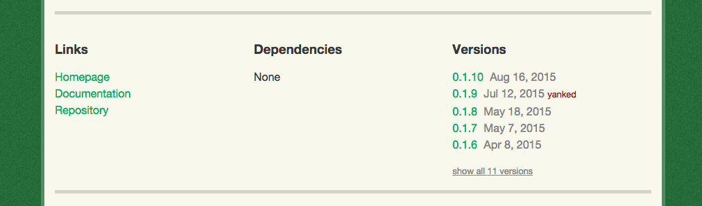
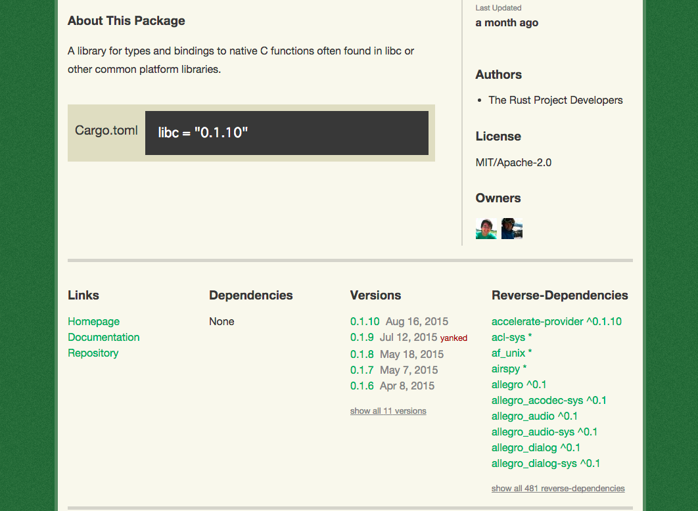

Crates.io Reverse Dependencies
==============================

This is a chrome extension to see reverse-dependencies in crate pages.

Screenshot
----------

### Before

### After

Installation
------------

1. Download the `.crx` file from the [release page](https://github.com/amutake/crates.io-reverse-dependencies/releases)
2. Drag and drop the `.crx` file into the extension page (`chrome://extensions`)

License
-------

MIT
